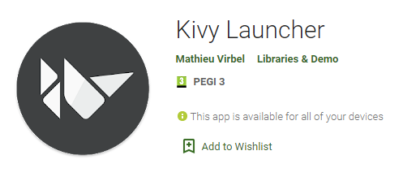

# WebinarCM

Projeto esqueleto para o Webinar de Computação Móvel 2021/2022

# Requisitos

Para conseguir acompanhar a construção durante o webinar é necessário instalar certos requisitos. Vão ser descritos nos passos abaixo.

1. Instalar python 3+
2. Instalar ffmpeg e adicioná-lo ao PATH do sistema (**Nota:** Instruções para Windows apenas)
    1. Fazer download [aqui](https://www.gyan.dev/ffmpeg/builds/ffmpeg-release-essentials.zip)
    2. Extrair o ficheiro .zip para um destino à sua escolha
    3. Abrir as variáveis do sistema através do menu do Windows pesquisando por > Editar as variáveis de ambiente do Sistema
    4. Clicar no botão > Variáveis de ambiente...
    5. Duplo clique na variável > Path
    6. Adicionar um novo registo e dar-lhe o path absoluto da pasta bin da pasta extraída do zip
3. Instalar todas as dependências do programa através de `pip install -r requirements.txt`
    1. Sugere-se que crie primeiro um ambiente virtual para não instalar diretamente as dependências para a sua instalação global do python através de `python -m venv venv`
    2. Para entrar no ambiente virtual basta inserir na linha de comandos no diretório que contêm a pasta `venv` o comando: `.\venv\Scripts\activate`
    3. Dentro do ambiente virtual, já pode fazer `pip install -r requirements.txt`
4. Para testar através do seu telemóvel android tem que instalar a aplicação de debug do Kivy através da AppStore.

5. Para conseguir testar a aplicação, é ncessário transferir os ficheiros python para o Kivy Launcher logo precisa de uma ferramenta de acesso a memória.
Pode utilizar um cabo USB ou transferir um servidor ftp para o telemóvel
